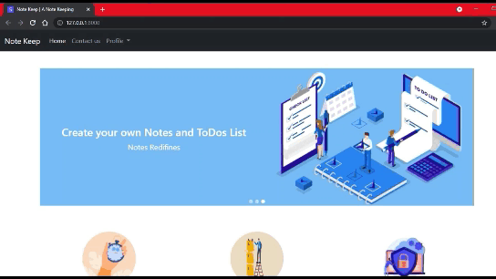

### Note Keeping App



Use ```python3``` instead of ```python``` if neccessary

Install all the dependencies 

```bash
$ pip install -r requirements.txt
```

Create a Super User for Admin using command

```bash
$ python manage.py createsuperuser
```

I have made the migrations for the created models, If you change then run the following commands if not then just for running purposes

```bash
$ python manage.py makemigrations
$ python manage.py migrate
```

Now Access the web app at local host 

```bash
$ python manage.py runserver
```

Access the admin panel at ```127.0.0.1/admin``` 
